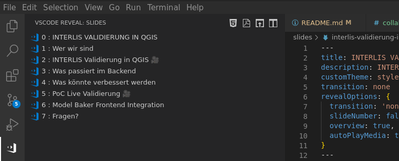

# SINGLE TALK TEMPLATE REPO

To fork and create a single talk on a seperate repo published with reveal-md and github pages.

- Slides available on the following link: https://signedav.github.io/single-talk-template/slides.html#/ (created by push on `main`)
- Press `F11` to maximize browser window.
- Press `s` to open Speaker Notes.
- Here we go.

## Programm

- Slides: Intro

## Work with VSCode
The easiest way is to install VSCode with the extension
[`vscode-reveal`](https://marketplace.visualstudio.com/items?itemName=evilz.vscode-reveal).

The `VSCode Reveal` plugin supports live-preview of the slides. Just click on the plugin on the left bar. Four toolbar buttons show up at the top. Click on `"Revealjs: Show presentation by side"` to instantly navigate through your presentation. Try out the other buttons for other preview modes and checkout the [docs](https://www.evilznet.com/vscode-reveal/#/README).

